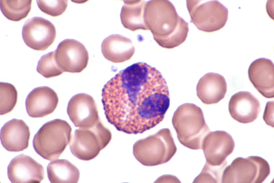
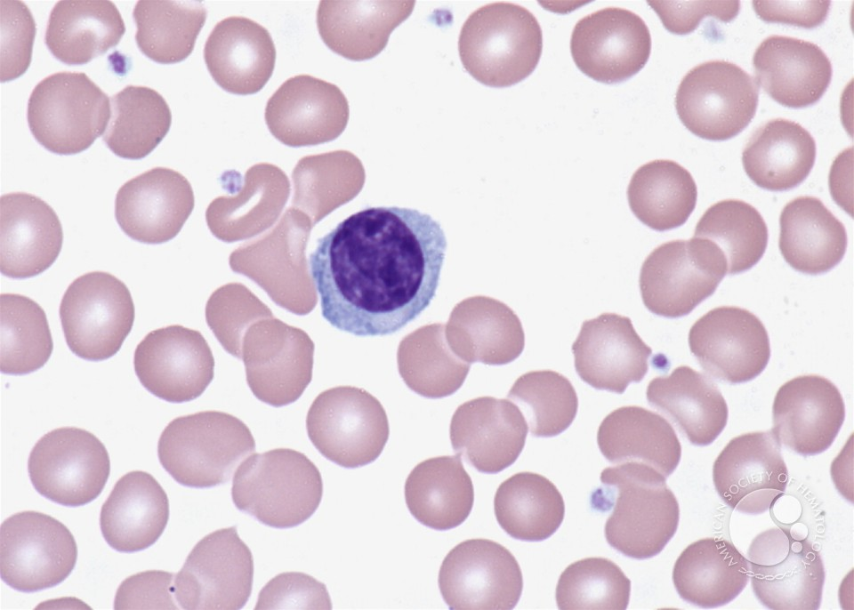
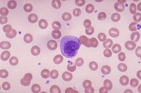
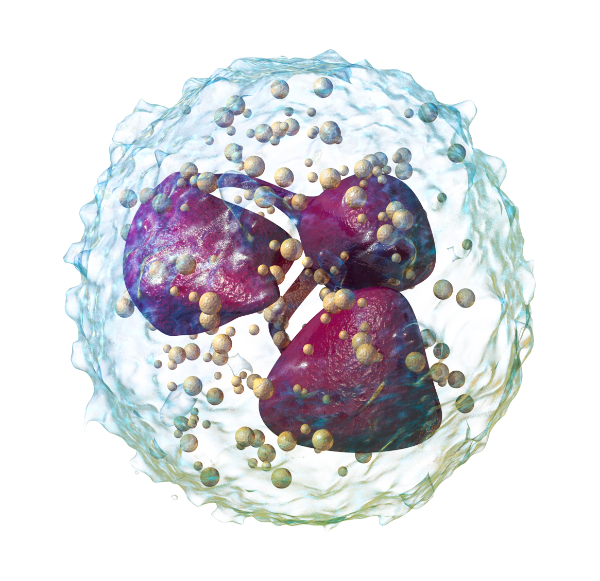

# Project Details
In this deep learning project I use keras to classify different different images of blood cells. This vision model was trained using Kaggle kernels GPUs. I use the functional keras model along with a custom built convolutional neural network and data augmentation so the model does not see the same image during training which prevents overfitting. 

# Data
Paul Mooney: https://www.kaggle.com/paultimothymooney/blood-cells

"This dataset contains 12,500 augmented images of blood cells (JPEG) with accompanying cell type labels (CSV). There are approximately 3,000 images for each of 4 different cell types grouped into 4 different folders (according to cell type). The cell types are Eosinophil, Lymphocyte, Monocyte, and Neutrophil."

# Classes

# 1) Eosinophil

# 2) Lymphocyte

# 3) Monocyte

# 4) Neutrophil

# Checkout My Deep Learning Blog!
https://medium.com/@TerranceWhitehurst

# Happy Learning!
